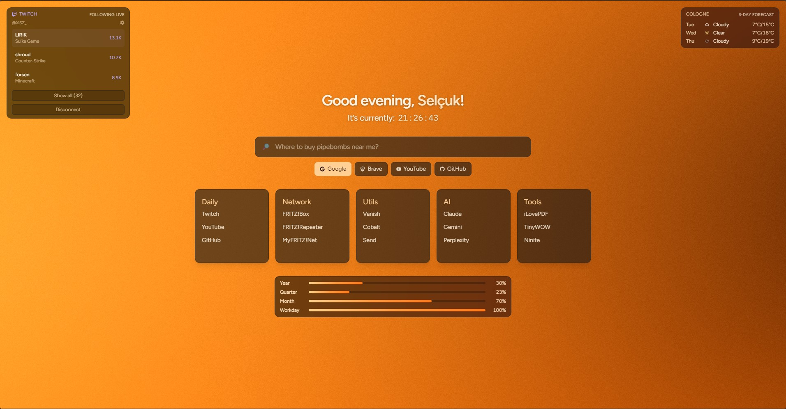

# whimsy

> **Fork** of [asteria-team/whimsy](https://github.com/asteria-team/whimsy)

A very stupid little startpage/newtab for your browser i made on a whim

## Preview

[Live Preview](https://xisz.pages.dev/)

## Build mode

This project now uses API routes for Twitch OAuth, so server runtime is required.

- Default build mode: server (works with Next.js API routes)
- Optional static export mode: set `NEXT_STATIC_EXPORT=true` (Twitch OAuth routes will not work in static export)

For Cloudflare Pages, use the Next.js framework runtime mode, not pure static export, if you want Twitch integration.

### Cloudflare Pages settings

If your deploy fails with `Output directory "out" not found`, your Pages project is still configured for legacy static export.

Use these settings:

- Build command: `npm run build:cf`
- Build output directory: `.vercel/output/static`
- Framework preset: `Next.js` (recommended)

Required environment variables in Cloudflare Pages:

- `TWITCH_CLIENT_ID`
- `TWITCH_CLIENT_SECRET`
- `TWITCH_OAUTH_REDIRECT_URI` (recommended, for example `https://your-domain.com/api/twitch/oauth/callback`)
- Optional: `TWITCH_MAX_CHANNELS`, `NEXT_PUBLIC_TWITCH_REFRESH_SECONDS`, `NEXT_PUBLIC_TWITCH_MAX_CHANNELS`

## Twitch widget setup

To enable the Twitch widget with frontend login, add these environment variables:

- `TWITCH_CLIENT_ID` (required)
- `TWITCH_CLIENT_SECRET` (required)
- `TWITCH_OAUTH_REDIRECT_URI` (recommended in production)
- `TWITCH_MAX_CHANNELS` (optional server default, defaults to `5`, capped at `100`)
- `NEXT_PUBLIC_TWITCH_REFRESH_SECONDS` (optional client default, defaults to `90`)
- `NEXT_PUBLIC_TWITCH_MAX_CHANNELS` (optional client default, defaults to `5`)

Then use the **Connect Twitch** button in the widget to authorize your account.

The widget now has a **Settings** toggle where you can configure:

- Refresh interval (`30s` to `600s`)
- Number of channels shown (`1` to `10`)
- Expand/collapse to show all currently live followed channels

These settings are saved in your browser (localStorage), so they are configurable without changing env variables.

Optional fallback mode (legacy, no UI login):

- `TWITCH_USER_ID`
- `TWITCH_ACCESS_TOKEN`
- `TWITCH_REFRESH_TOKEN`

## Get Twitch client id and client secret

1. Open the Twitch Developer Console: [https://dev.twitch.tv/console/apps](https://dev.twitch.tv/console/apps)
2. Click **Register Your Application** (or **Create App**).
3. Fill out:
   - Name: any app name, for example `whimsy`
   - OAuth Redirect URL: `http://localhost:3000/api/twitch/oauth/callback` for local dev
   - Category: any suitable category (for example Website Integration)
4. Save the app.
5. Copy **Client ID** and set it as `TWITCH_CLIENT_ID`.
6. Click **New Secret** in the app details.
7. Copy the generated secret immediately and set it as `TWITCH_CLIENT_SECRET`.

Important:

- Add your production callback URL too if you deploy (for example `https://your-domain.com/api/twitch/oauth/callback`).
- Keep `TWITCH_CLIENT_SECRET` server-only and never expose it in client-side env vars.
